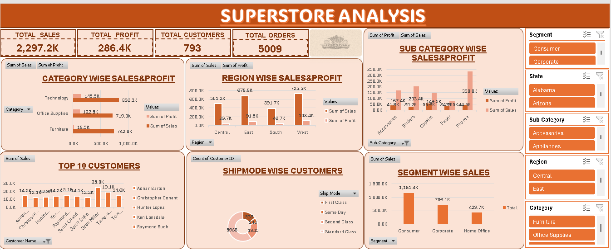

# 📊 Sales Performance Dashboard (Excel)

## 📌 Objective
Analyze sales data to identify trends, top-performing categories, and customer insights.

## 🛠 Tools Used
- Microsoft Excel
- Pivot Tables
- Charts

## 📊 Dashboard Preview

## 🔍 Key Insights
- Consumer segment contributes the highest sales
- Technology category drives maximum revenue
- Regional sales show variation in profit margins

## 📁 Dataset
Superstore dataset

## 🚀 Project Outcome
Built an interactive dashboard to support business decision-making.
